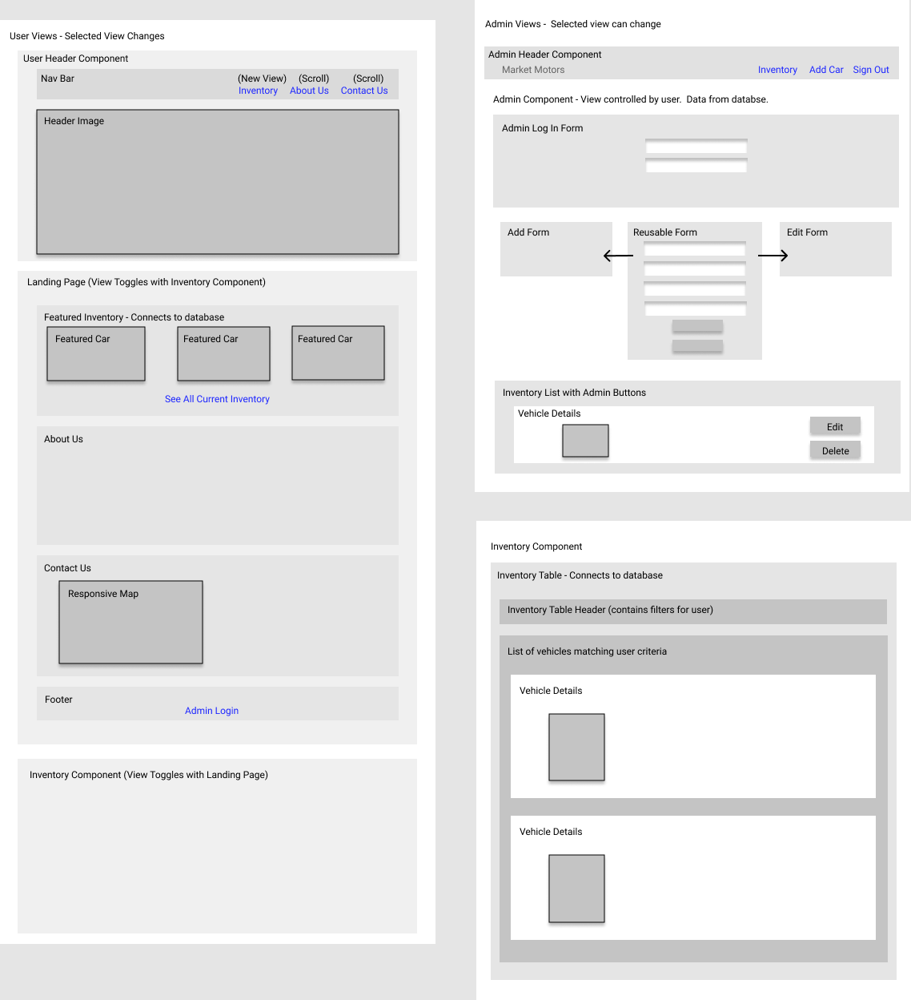
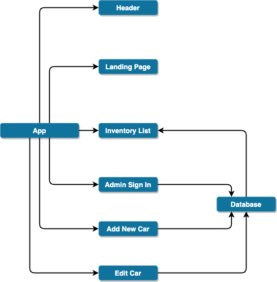
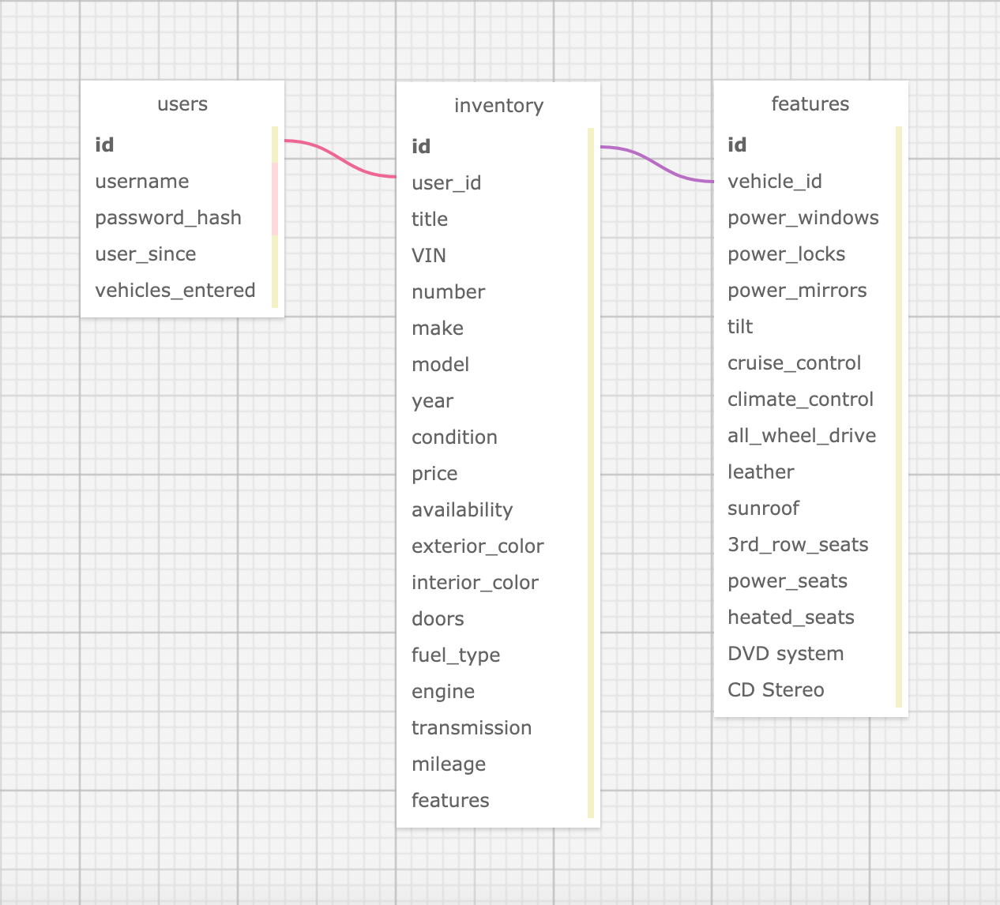

# Market Motors

#### A commercial website for viewing and managing vehicle inventory.

#### Created by K. Wicz

## Overview

This site will be an opportunity for customers to learn more about the current inventory of the website.  This website will also allow authorized website employees to add, edit, and remove vehicles from the list of current inventory.

### User Stories

> _"As a customer, I want to be able to quickly find where the dealership is located and how to contact the business."_

> _"As a customer, I want to see a list of current inventory and see it displayed by customized filters, like year, price, and mileage."_

> _"As an administrative user, I want to be able to log in with a pre-authorized user id and password."_

>_"As an administrative user, I want to be able to be able to add, edit, and delete inventory from the database of current inventory."_

## Project Organization

||
|:---:|
|Monochromatic Site Wireframe|
|
|React Components Tree Diagram|
||
|Database Table Structure|
||


#### Setup/Installation

1. Clone the Repository from GitHub
    ```sh
    git clone https://github.com/kwicz/market-motors
    cd market-motors
    ```


2. Launch the back end applicaiton
* Install .NET Core
  * [Click here](https://dotnet.microsoft.com/download/thank-you/dotnet-sdk-2.2.106-macos-x64-installer) to download a .NET Core SDK from Microsoft Corp.
  * [Click here](https://dotnet.microsoft.com/download/thank-you/dotnet-sdk-2.2.203-windows-x64-installer) to download the 64-bit .NET Core SDK from Microsoft Corp.
* Install all necessary packages and build the project:
    ```sh
    cd MarketMotorsAPI
    dotnet restore
    dotnet build
    ```
* Build the MySQL database locally:
  ```sh
  dotnet ef migrations add Initial
  dotnet ef database update
  ```
* Launch the project on your local server so the API can be queried:
  ```sh
  dotnet watch run
  ```
* Open your preferred browser and navigate to `https://localhost:5001/`

3. Launch the front end application
* Navigate to React directory and install necessary packages:
  ```sh
  cd market-motors-site
  npm install
  ```
* Once packages have installed, launch the project in your local server:
  ```sh
  npm start
  ```
* In a new tab in your browser, navigate to `http://localhost:3000/homepage`


### Technologies Used

#### Frameworks and Packages
* Frontend Framework: [React.js](https://reactjs.org/)
* React Libraries: Redux
* CSS Style Library: [Material-UI](https://material-ui.com/)
* Backend Framework: C#/.NET
* ORM: EF Core
* Database: MySQL

#### Planning Tools
* [Figma](https://www.figma.com/)
* [diagrams.net](https://www.diagrams.net/)
* [WWW SQL DESIGNER](https://ondras.zarovi.cz/sql/demo/)

#### Additional Resources
* Google Maps API

### Support and Contact Details
_Have a bug or an issue with this application? [Open a new issue](https://github.com/kwicz/market-motors/issues) here on GitHub._

### License

[](LICENSE)

Copyright (c) 2020 **_K. Wicz_**